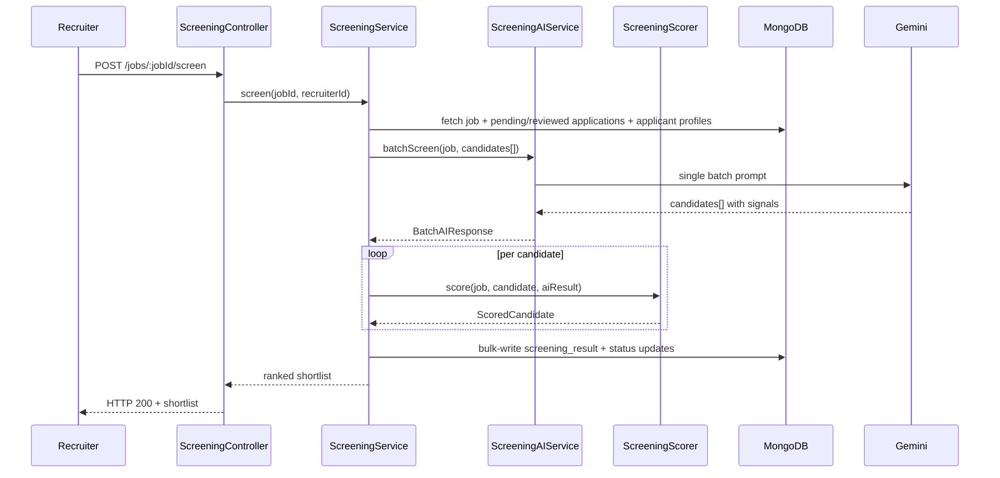

# Design Document — AI Candidate Screening

## Overview

This feature adds AI-powered candidate screening and ranking to the recruitment backend. A recruiter triggers a single `POST /jobs/:jobId/screen` endpoint; the system fetches all eligible applications, sends them to Gemini in one batch call, runs a fully deterministic scoring engine over the AI-extracted signals, persists results, and returns a ranked shortlist.

The design separates concerns cleanly:
- **AI layer** — one batch Gemini call, prompt loaded from a versioned `.txt` file
- **Scoring engine** — pure, stateless, deterministic arithmetic (no I/O)
- **Orchestrator** — wires AI + scorer + DB together
- **HTTP layer** — thin controller + routes

---

## Architecture



### Module Boundaries

```
src/modules/
├── ai/
│   ├── ai.service.ts                  (existing BaseAIService)
│   ├── screening.ai.service.ts        (NEW — extends BaseAIService)
│   └── prompts/
│       └── screening-batch.prompt.txt (NEW — single batch prompt)
└── screening/
    ├── screening.types.ts             (NEW — ScreeningResult, BatchAIResponse, etc.)
    ├── screening.scorer.ts            (NEW — pure scoring engine)
    ├── screening.service.ts           (NEW — orchestrator)
    ├── screening.repository.ts        (NEW — DB reads/writes)
    ├── screening.controller.ts        (NEW — HTTP handlers)
    └── screening.routes.ts            (NEW — route registration)
```

---

## Components and Interfaces

### ScreeningAIService (`screening.ai.service.ts`)

Extends `BaseAIService<BatchAIResponse>`. Responsible for constructing the batch prompt and calling Gemini once.

```typescript
class ScreeningAIService extends BaseAIService<BatchAIResponse> {
    // Loads screening-batch.prompt.txt at construction time
    // Throws if prompt file is missing (fail-fast at startup)
    constructor(apiKey?: string)

    // Builds the full batch prompt: job context + one condensed block per candidate
    // Returns null if Gemini returns malformed/incomplete response
    async batchScreen(job: JobJSON, candidates: CandidateInput[]): Promise<BatchAIResponse | null>
}
```

**Gemini config** (matches existing pattern, enforces determinism):
- `temperature: 0`, `topP: 0.1`, `topK: 40`
- `responseMimeType: "application/json"` with `responseSchema` derived from `BatchAIResponse`

---

### ScreeningScorer (`screening.scorer.ts`)

A pure class with no I/O. All methods are deterministic given the same inputs. Each scoring step is commented to explain the formula and its rationale.

```typescript
class ScreeningScorer {
    // Entry point — returns a fully scored candidate or a disqualified one
    score(job: JobJSON, candidate: CandidateInput, aiResult: AICandidate | null): ScoredCandidate

    // skills_score = Σ(signal.score × skill.weight) / Σ(skill.weight)
    private computeSkillsScore(skills: Skill[], signals: SkillSignal[]): number

    // experience_score = min(totalYears / minYears, 1.0)
    private computeExperienceScore(experience: ExperienceEntry[], minYears: number): number

    // education_score = min(candidateTier / requiredTier, 1.0)
    private computeEducationScore(education: EducationEntry[], required: EducationRequirement[]): number

    // resources_score = matched / total (case-insensitive)
    private computeResourcesScore(resources: Resource[], skills: SkillEntry[], cvRawText: string): number

    // soft_skills_score = Σ(signal.score × soft_skill.weight) / Σ(soft_skill.weight)
    private computeSoftSkillsScore(softSkills: SoftSkill[], signals: SoftSkillSignal[]): number

    // Applies hard disqualification rules before computing final score
    private applyDisqualificationRules(job: JobJSON, candidate: CandidateInput, signals: SkillSignal[], totalYears: number): DisqualificationResult

    // Rounds a number to N decimal places (default 6 for intermediates, 2 for final)
    private round(value: number, places: number): number
}
```

---

### ScreeningService (`screening.service.ts`)

Orchestrates the full screening pipeline.

```typescript
class ScreeningService {
    constructor(
        private aiService: ScreeningAIService,
        private scorer: ScreeningScorer,
        private repo: ScreeningRepository
    )

    // POST /jobs/:jobId/screen handler logic
    async screen(jobId: string, recruiterId: string): Promise<ShortlistEntry[]>

    // GET /jobs/:jobId/shortlist handler logic
    async getShortlist(jobId: string, recruiterId: string, limit: 10 | 20): Promise<ShortlistEntry[]>
}
```

---

### ScreeningRepository (`screening.repository.ts`)

Handles all MongoDB reads and writes for the screening feature.

```typescript
class ScreeningRepository {
    // Fetch job by ID (returns null if not found)
    async findJob(jobId: string): Promise<JobJSON | null>

    // Fetch all applications with status "pending" or "reviewed" for a job,
    // joined with applicant profile data
    async findEligibleApplications(jobId: string): Promise<ApplicationWithApplicant[]>

    // Bulk-write screening_result + status update for each application
    async saveScreeningResults(results: ApplicationUpdate[]): Promise<void>

    // Fetch all applications with a screening_result for a job,
    // sorted by final_score descending, limited to N
    async findShortlist(jobId: string, limit: number): Promise<ShortlistEntry[]>
}
```

---

### ScreeningController (`screening.controller.ts`)

Thin HTTP layer — validates inputs, delegates to service, formats responses.

```typescript
// POST /jobs/:jobId/screen
async triggerScreening(req, res): Promise<void>

// GET /jobs/:jobId/shortlist?limit=10|20
async getShortlist(req, res): Promise<void>
```

---

## Data Models

### New Types (`screening.types.ts`)

```typescript
// Per-skill signal returned by Gemini
export interface SkillSignal {
    skill_name: string;
    score: 0 | 0.5 | 1.0;
}

// Per-soft-skill signal returned by Gemini
export interface SoftSkillSignal {
    skill_name: string;
    score: number; // 0.0 – 1.0
}

// One candidate entry in the Gemini batch response
export interface AICandidate {
    applicant_id: string;
    skill_signals: SkillSignal[];
    soft_skill_signals: SoftSkillSignal[];
    strengths: string[];
    gaps: string[];
    recommendation: string;
}

// Top-level Gemini response
export interface BatchAIResponse {
    candidates: AICandidate[];
}

// Per-dimension score breakdown (all values 0.0 – 1.0)
export interface DimensionBreakdown {
    skills: number;
    experience: number;
    education: number;
    resources: number;
    soft_skills: number;
}

// The result attached to an Application after screening
export interface ScreeningResult {
    rank: number | null;          // null for disqualified candidates
    final_score: number;          // 0 – 100, rounded to 2dp
    dimension_breakdown: DimensionBreakdown;
    strengths: string[];
    gaps: string[];
    recommendation: string;
    screened_at: Date;
}

// Input shape assembled by ScreeningService before calling scorer
export interface CandidateInput {
    application_id: string;
    applicant_id: string;
    appliedAt: Date;
    cvRawText: string;
    profile: ApplicantProfileJSON;
}

// Internal result after scoring, before DB write
export interface ScoredCandidate {
    application_id: string;
    applicant_id: string;
    appliedAt: Date;
    screening_result: ScreeningResult;
    new_status: ApplicationStatus;
}

// Shape returned by the shortlist endpoint
export interface ShortlistEntry {
    application_id: string;
    applicant_id: string;
    first_name: string;
    last_name: string;
    headline: string;
    screening_result: ScreeningResult;
}
```

### ApplicationJSON Extension

The existing `ApplicationJSON` in `application.types.ts` needs one new optional field:

```typescript
export interface ApplicationJSON {
    // ... existing fields ...
    screening_result?: ScreeningResult; // populated after screening
}
```

---

## Scoring Engine — Detailed Logic with Pseudocode

### Step 1 — Compute `candidate_total_years`

```
// Sum durations across all experience entries.
// For current roles (is_current=true or no end_date), use today as end_date.
// Duration = (end_date - start_date) in fractional years.
totalYears = 0
for each entry in profile.experience:
    start = parseDate(entry.start_date)
    end   = entry.end_date ? parseDate(entry.end_date) : today
    totalYears += (end - start) in years
```

### Step 2 — Apply Hard Disqualification Rules (BEFORE scoring)

```
disqualified = false
disqualReasons = []

// Rule A: required skills must match
if job.scoring_config.rules.required_skills_must_match:
    for each skill in job.skills where skill.required == true:
        signal = find signal in aiResult.skill_signals where skill_name matches skill.name
        if signal is null or signal.score == 0.0:
            disqualified = true
            disqualReasons.push("Required skill missing: " + skill.name)

// Rule B: minimum experience
if job.scoring_config.rules.min_experience_required:
    minYears = job.requirements.experience.min_years ?? 0
    if totalYears < minYears:
        disqualified = true
        disqualReasons.push("Experience below minimum: " + totalYears + " < " + minYears + " years")

if disqualified:
    return ScoredCandidate {
        final_score: 0,
        rank: null,
        gaps: disqualReasons,
        new_status: "rejected"
    }
```

### Step 3 — Compute Dimension Scores

```
// --- Skills Score (weight: 0.5) ---
// Weighted average of AI-extracted skill match signals.
// Missing signals default to 0.0 (AI returned nothing for that skill).
weightSum = Σ skill.weight for all skills in job.skills
signalSum = Σ (getSignal(skill.name, aiResult) × skill.weight) for all skills
skills_score = round(signalSum / weightSum, 6)   // 0.0 if weightSum == 0

// --- Experience Score (weight: 0.25) ---
// Linear scale capped at 1.0. Rewards meeting/exceeding the minimum.
minYears = job.requirements.experience.min_years ?? 0
experience_score = minYears > 0
    ? round(min(totalYears / minYears, 1.0), 6)
    : 1.0   // no requirement = full score

// --- Education Score (weight: 0.1) ---
// Map candidate's highest degree and job's highest required degree to numeric tiers.
// Tier map: none=0.0, high_school=0.25, associate=0.5, bachelor=0.75, master=0.9, phd=1.0
candidateTier = highestTier(profile.education)
requiredTier  = highestTier(job.requirements.education)
education_score = requiredTier > 0
    ? round(min(candidateTier / requiredTier, 1.0), 6)
    : 1.0   // no requirement = full score

// --- Resources Score (weight: 0.05) ---
// Count how many required resources appear in the candidate's skill list or raw CV text.
// Match is case-insensitive substring check.
requiredResources = job.resources.filter(r => r.required)
matched = requiredResources.filter(r =>
    profile.skills.some(s => s.name.toLowerCase() == r.name.toLowerCase())
    OR cvRawText.toLowerCase().includes(r.name.toLowerCase())
)
resources_score = requiredResources.length > 0
    ? round(matched.length / requiredResources.length, 6)
    : 1.0   // no required resources = full score

// --- Soft Skills Score (weight: 0.1) ---
// Weighted average of AI-inferred soft skill signals.
// Missing signals default to 0.0.
softWeightSum = Σ (soft_skill.weight ?? 1.0) for all soft_skills in job.soft_skills
softSignalSum = Σ (getSoftSignal(soft_skill.name, aiResult) × (soft_skill.weight ?? 1.0))
soft_skills_score = softWeightSum > 0
    ? round(softSignalSum / softWeightSum, 6)
    : 0.0   // empty soft_skills array = 0.0 (per requirement 4.3)
```

### Step 4 — Compute Final Score

```
// Weighted combination of all five dimension scores.
// Weights come from job.scoring_config.weights (default: skills=0.5, exp=0.25, edu=0.1, res=0.05, soft=0.1).
// Intermediate scores are already rounded to 6dp in Step 3.
w = job.scoring_config.weights
raw = (skills_score    × w.skills)
    + (experience_score × w.experience)
    + (education_score  × w.education)
    + (resources_score  × w.resources)
    + (soft_skills_score × w.soft_skills)

final_score = round(raw × 100, 2)   // 0.00 – 100.00
```

### Step 5 — Rank and Sort

```
// Separate disqualified (final_score == 0, status == "rejected") from eligible.
eligible     = scored.filter(c => c.new_status != "rejected")
disqualified = scored.filter(c => c.new_status == "rejected")

// Sort eligible candidates: primary = final_score DESC, tie-break = appliedAt ASC
eligible.sort((a, b) =>
    b.final_score - a.final_score
    || a.appliedAt - b.appliedAt
)

// Assign 1-based ranks
eligible.forEach((c, i) => c.screening_result.rank = i + 1)

// Disqualified candidates get rank = null (already set in Step 2)
```

---

## Batch Prompt Design (`screening-batch.prompt.txt`)

The prompt is structured in two sections:

**Section 1 — Job Context (sent once)**
```
You are an expert technical recruiter evaluating candidates for the following role:

Title: {job.title}
Seniority: {job.seniority_level}
Domain: {job.domain.primary}

Required Skills (with weights and required flags):
{job.skills formatted as: "- {name} (weight: {weight}, required: {required}, expected level: {level})"}

Soft Skills to evaluate:
{job.soft_skills formatted as: "- {name} (weight: {weight})"}

Minimum experience required: {min_years} years
Education requirement: {highest required level}
```

**Section 2 — Candidate Profiles (one block per candidate)**
```
Candidate {applicant_id}:
Skills: {profile.skills formatted as "name (level, N years)"}
Experience: {total years} years total — {role at company, dates}
Education: {highest degree, field}
Bio: {profile.bio}
CV Text (excerpt): {first 500 chars of cvRawText}
---
```

**Output instruction:**
```
Return a JSON object with a "candidates" array. For each candidate include:
- applicant_id (string, must match input)
- skill_signals: array of {skill_name, score} where score is 0.0, 0.5, or 1.0
- soft_skill_signals: array of {skill_name, score} where score is 0.0–1.0
- strengths: array of strings describing top-performing areas
- gaps: array of strings describing missing or weak areas
- recommendation: 2–4 sentence summary of candidate fit
```

---

## Error Handling

| Scenario | Behaviour |
|---|---|
| Job not found or wrong recruiter | HTTP 403 |
| No eligible applications | HTTP 200 + `{ results: [], message: "No candidates found" }` |
| Gemini returns null / malformed | All signals default to 0.0; error logged; scoring continues |
| DB write fails for one application | Log error; continue processing remaining; do not abort run |
| Prompt file missing at startup | Throw descriptive error; service fails to initialise |
| `limit` query param not 10 or 20 | HTTP 400 with validation message |
| Gemini timeout (20 s) | Treat as null response; all signals default to 0.0 |

---

## Testing Strategy

### Unit Tests (example-based)

- `ScreeningScorer` — one test per scoring formula with concrete inputs and expected outputs
- Edge cases: empty skills array, zero min_years, no required resources, empty soft_skills, both disqualification rules firing simultaneously
- `ScreeningAIService` — verify prompt construction includes job title and all candidate IDs
- `ScreeningController` — verify HTTP 400 for invalid `limit`, HTTP 403 for wrong recruiter

### Property-Based Tests

The scoring engine is a pure function — ideal for property-based testing. Use a PBT library (e.g., **fast-check** for TypeScript) with a minimum of **100 iterations per property**.

Each test is tagged: `// Feature: ai-candidate-screening, Property N: <property text>`

### Integration Tests

- Full screening pipeline with mocked Gemini (verify DB writes and response shape)
- Shortlist retrieval after a screening run

---

## Correctness Properties

*A property is a characteristic or behavior that should hold true across all valid executions of a system — essentially, a formal statement about what the system should do. Properties serve as the bridge between human-readable specifications and machine-verifiable correctness guarantees.*

### Property 1: Skills score is a valid weighted average

*For any* non-empty list of job skills with positive weights and a corresponding list of signals (each score in {0, 0.5, 1.0}), the computed `skills_score` must equal `Σ(signal.score × skill.weight) / Σ(skill.weight)` and lie in [0.0, 1.0].

**Validates: Requirements 3.1**

---

### Property 2: Experience score is capped at 1.0

*For any* candidate total years ≥ 0 and minimum years required > 0, `experience_score = min(totalYears / minYears, 1.0)` and the result is always in [0.0, 1.0].

**Validates: Requirements 3.2**

---

### Property 3: Education score respects tier ordering

*For any* candidate degree level and required degree level drawn from the defined tier map, `education_score = min(candidateTier / requiredTier, 1.0)` and the result is always in [0.0, 1.0]. A candidate whose degree meets or exceeds the requirement always receives a score of 1.0.

**Validates: Requirements 3.3**

---

### Property 4: Resources score is a valid ratio

*For any* list of required resources and any candidate skill list + cvRawText, `resources_score = matched / total` and the result is always in [0.0, 1.0]. Adding a resource that is already matched does not decrease the score.

**Validates: Requirements 3.4**

---

### Property 5: Soft skills score is a valid weighted average

*For any* non-empty list of job soft skills with weights and a corresponding list of signals (each score in [0.0, 1.0]), the computed `soft_skills_score` must equal `Σ(signal.score × weight) / Σ(weight)` and lie in [0.0, 1.0].

**Validates: Requirements 3.5, 4.2**

---

### Property 6: Final score is a deterministic weighted combination

*For any* valid set of five dimension scores (each in [0.0, 1.0]) and a valid weights configuration (weights sum to 1.0), `final_score = round(Σ(dimension_score × weight) × 100, 2)` and the result is always in [0.00, 100.00]. Running the scorer twice with identical inputs produces identical `final_score` values.

**Validates: Requirements 3.6, 3.7, 3.8, 10.2, 10.3**

---

### Property 7: Required-skill disqualification is universal

*For any* candidate where at least one job skill marked `required: true` has a signal score of `0.0`, and `scoring_config.rules.required_skills_must_match = true`, the scorer must return `final_score = 0` and `new_status = "rejected"` regardless of all other dimension scores.

**Validates: Requirements 5.1**

---

### Property 8: Minimum-experience disqualification is universal

*For any* candidate where `candidate_total_years < job.requirements.experience.min_years` and `scoring_config.rules.min_experience_required = true`, the scorer must return `final_score = 0` and `new_status = "rejected"` regardless of all other dimension scores.

**Validates: Requirements 5.2**

---

### Property 9: Shortlist excludes all disqualified candidates

*For any* screening run over any set of candidates, no candidate with `new_status = "rejected"` (i.e., `final_score = 0` due to disqualification) shall appear in the ranked shortlist returned by the service.

**Validates: Requirements 5.3**

---

### Property 10: Shortlist is sorted descending by final score with tie-break

*For any* set of screened candidates, the shortlist must be sorted by `final_score` descending. For any two candidates with equal `final_score`, the one with the earlier `appliedAt` timestamp must receive the lower rank number (higher position).

**Validates: Requirements 8.1, 10.4**

---

### Property 11: Shortlist respects the limit parameter

*For any* set of N screened candidates where N > limit, the returned shortlist must contain exactly `limit` entries (10 or 20). The entries must be the top-`limit` candidates by score.

**Validates: Requirements 8.2**

---

### Property 12: Every shortlist entry contains required fields

*For any* shortlist entry returned by `GET /jobs/:jobId/shortlist`, the entry must contain `screening_result` (with all five dimension scores, `final_score`, `rank`, `strengths`, `gaps`, `recommendation`) and the applicant's `first_name`, `last_name`, and `headline`.

**Validates: Requirements 6.1, 8.4**

---

### Property 13: Batch AI call count is always one

*For any* screening run with N ≥ 1 eligible candidates, the `ScreeningAIService.batchScreen` method must be called exactly once, regardless of N.

**Validates: Requirements 2.1**
