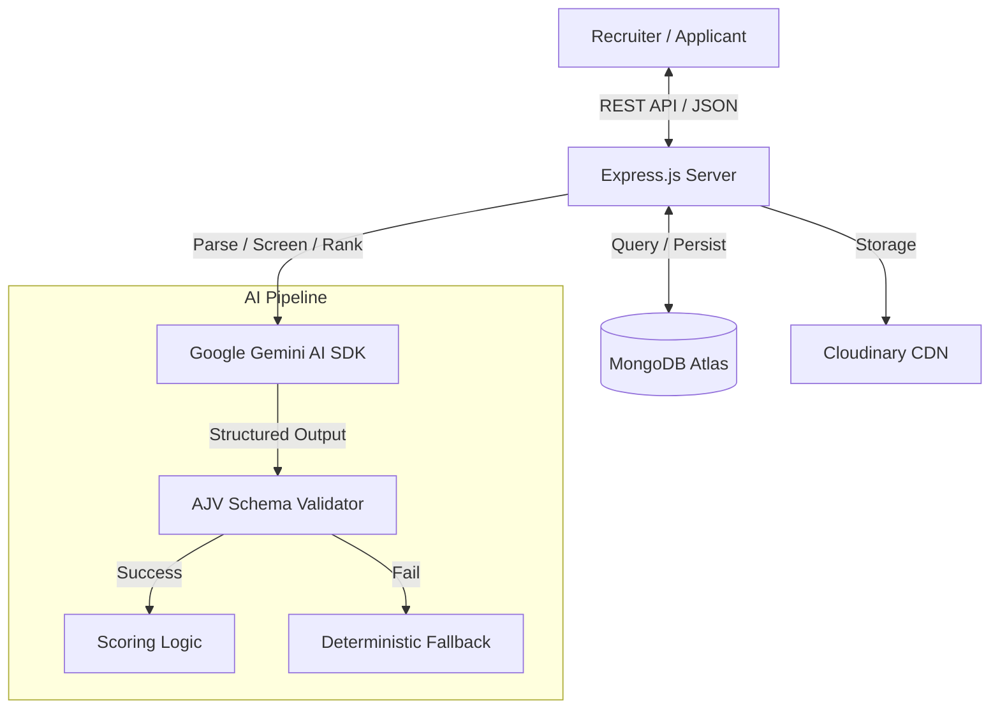
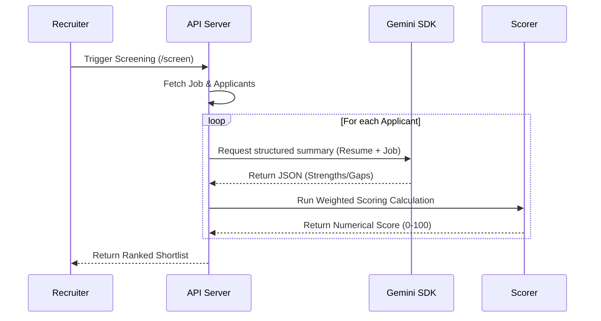

# Umurava Backend AI Service

## System Architecture



## Setup
1. Ensure you have Node.js >= 20.0.0 installed.
2. Install dependencies:
   ```bash
   npm install
   ```
3. Create a `.env` file from `.env.example`:
   ```bash
   cp .env.example .env
   ```
4. Configure your environment variables in `.env`.

## Environment Variables

| Variable | Description | Example |
|----------|-------------|---------|
| `PORT` | Server port | `3001` |
| `MONGODB_URI` | Connection string for MongoDB | `mongodb+srv://...` |
| `JWT_SECRET` | Secret key for access tokens | `your_secret` |
| `REFRESH_SECRET` | Secret key for refresh tokens | `your_refresh_secret` |
| `GEMINI_API_KEY` | API key from Google AI Studio | `AIza...` |
| `GEMINI_AI_MODEL` | Model version to use | `gemini-1.5-flash` |
| `CLOUDINARY_CLOUD_NAME` | Cloudinary name | `umurava` |
| `CLOUDINARY_API_KEY` | Cloudinary API Key | `...` |
| `CLOUDINARY_API_SECRET` | Cloudinary API Secret | `...` |

## Running the Server

| Command | Description |
|---------|-------------|
| `npm run dev` | Development mode with hot-reload (`tsx watch`) |
| `npm start` | Production / one-shot start (`tsx src/index.ts`) |
   - **IMPORTANT**: `MONGODB_TLS_ALLOW_INVALID_CERTS` is for local development only. Do NOT enable it in production unless strictly necessary for corporate proxy environments, and always ensure `ALLOW_DEVELOPMENT_CERTS=true` is set to acknowledge the risk.

## Deployment Instructions

### Standard Node.js
1. Build the project (if using a build step) or run directly with `tsx`.
2. Ensure all environment variables are set in your CI/CD platform.
3. Start the process: `npm start`.

### Cloud Deployment (Railway / Render)
1. Link your GitHub repository.
2. The system detects `package.json` and uses the `start` script.
3. Add the required environment variables in the dashboard.
4. (Optional) For Railway, `nixpacks.toml` is included to optimize the build environment.

## Logging

Console log format is controlled by the `NODE_ENV` environment variable:

- **Development** (`NODE_ENV` unset or any non-`"production"` value): colorized, human-readable format.
- **Production** (`NODE_ENV=production`): structured JSON format, suitable for log aggregation tools.

In non-production environments, logs are also written to files under the `logs/` directory.

## Job State Machine

Jobs follow a strict status lifecycle: `draft → published`. The following rules apply:

- **`patchJob`**: Only jobs in `"draft"` state can be edited. Attempting to patch a `"published"` or `"archived"` job returns a `400` error: `"Job is not in draft state and cannot be edited"`.
- **`publishJob`**: Only jobs in `"draft"` state can be published. Attempting to publish a non-draft job returns a `400` error: `"Job is not in draft state and cannot be published"`.

Both operations also enforce recruiter ownership — patching or publishing a job you don't own returns a `403 Forbidden`.

## API Documentation

Interactive Swagger UI is available at `GET /api/v1/docs` once the server is running. The raw OpenAPI JSON spec can be fetched from `GET /api/v1/docs.json` (useful for Postman import or client code generation).

The base URL is driven by the `API_BASE_URL` environment variable. If unset, it defaults to `http://localhost:3001`.

Module-level docs are imported explicitly in `src/docs/swagger.ts` — each module owns its own doc file (e.g. `src/docs/auth.docs.ts`) and is merged into the spec at startup.

## API Routes

All routes are mounted under `/api/v1`.

| Method | Path | Auth | Description |
|--------|------|------|-------------|
| `POST` | `/auth/register` | — | Register a new user (applicant or recruiter) |
| `POST` | `/auth/login` | — | Login and obtain JWT tokens |
| `POST` | `/auth/refresh` | — | Refresh access token |
| `GET` | `/jobs` | — | List all published jobs (public view, no scoring weights) |
| `POST` | `/jobs` | recruiter | Create a job from raw description (AI-structured) |
| `GET` | `/jobs/my-jobs` | recruiter | List own jobs (all statuses, includes scoring config) |
| `GET` | `/jobs/recruiter/:id` | recruiter (owner) | Get full job details including scoring config |
| `GET` | `/jobs/:id` | — | Get single job public view |
| `PATCH` | `/jobs/:id` | recruiter (owner) | Edit a draft job |
| `PATCH` | `/jobs/:id/publish` | recruiter (owner) | Publish a draft job |
| `POST` | `/jobs/:jobId/screen` | recruiter (owner) | Trigger AI candidate screening |
| `GET` | `/jobs/:jobId/shortlist` | recruiter (owner) | Retrieve ranked shortlist |
| `POST` | `/applicants/upload-cv` | authenticated | Step 1 — Upload PDF CV; AI extracts and returns structured profile (not saved yet) |
| `POST` | `/applicants/save-profile` | authenticated | Step 2 — Persist the reviewed profile (upsert) |
| `GET` | `/applicants/profile` | authenticated | Get own applicant profile |
| `PATCH` | `/applicants/profile` | authenticated | Partially update profile fields |
| `POST/GET` | `/recruiters/profile` | recruiter | Recruiter company profile |
| `POST` | `/applications/:jobId` | applicant | Apply to a job |
| `GET` | `/applications/my` | applicant | List own applications |
| `GET` | `/applications/:applicationId` | — | Get single application |
| `GET` | `/applications/job/:jobId` | recruiter | List applications for a job |
| `PATCH` | `/applications/:applicationId/status` | recruiter | Update application status |
| `POST` | `/sourcing/bulk-import` | recruiter | Scenario 2: Import candidates via CSV/Excel |
| `POST` | `/sourcing/batch-upload-cvs` | recruiter | Scenario 2: Upload multiple PDF CVs for a job |
| `GET` | `/sourcing/template` | recruiter | Download CSV template for bulk import |

Screening routes are nested under `/jobs/:jobId` with `mergeParams` enabled so handlers have access to `:jobId` directly.

### Applicant Profile — Two-Step CV Flow

Creating an applicant profile is a two-step process:

1. **`POST /applicants/upload-cv`** — Upload a PDF (max 5 MB). The file is stored on Cloudinary and its text is extracted and sent to Gemini AI, which returns a structured `ApplicantProfile` JSON. The profile is **not saved** at this point — it is returned for the applicant to review and edit.
2. **`POST /applicants/save-profile`** — Send the (optionally edited) profile JSON to persist it. This is an upsert — calling it again replaces the existing profile.

Once a profile exists, `GET /applicants/profile` retrieves it and `PATCH /applicants/profile` updates individual fields using dot-notation paths (e.g. `"profile.headline"`, `"profile.availability.status"`).

---

### Jobs — Zero Trust Data Model

The Jobs API exposes two views of the same document:

- **Public view** (`GET /jobs`, `GET /jobs/:id`): `scoring_config` and skill `weight` fields are stripped. Safe for applicants.
- **Recruiter full view** (`GET /jobs/my-jobs`, `GET /jobs/recruiter/:id`): includes `scoring_config.weights`, `scoring_config.rules`, and per-skill weights. Requires ownership.

### Job Creation Flow

`POST /jobs` accepts a raw `description` string. Gemini AI parses it into a fully structured job document (skills with weights, scoring config, requirements, domain classification). The job is created in `draft` status — call `PATCH /jobs/:id/publish` to make it live.

On success the endpoint returns `201` with `{ success: true, data: { acknowledged: true, insertedId: "<ObjectId>" } }` — not the full job document. Use `GET /api/v1/jobs/recruiter/:id` with the returned `insertedId` to fetch the structured result.

Two distinct `400` cases are possible:
- `"Job description is required"` — the `description` field was missing from the request body.
- `"Failed to parse job description"` — the description was present but the AI could not extract a valid job structure from it.

---

## AI Candidate Screening

Recruiters can trigger AI-powered screening via `POST /jobs/:jobId/screen`. Candidates are evaluated across five dimensions (skills, experience, education, resources, soft skills) using a deterministic weighted scoring engine.

### Scoring Weights (`scoring_config.weights`)

Each job's `scoring_config.weights` object controls how much each dimension contributes to the final score. Weights should sum to `1.0` (e.g. `skills: 0.5, experience: 0.25, education: 0.1, resources: 0.05, soft_skills: 0.1`).

If the weights don't sum to `1.0`, the scorer **automatically normalises** them at runtime so the final score always falls in the `[0, 100]` range. A `console.warn` is emitted when this happens, so misconfigured jobs are detectable in logs. If all weights are `0` or negative, the scorer falls back to equal weights (`0.2` each).

### AI Unavailability Fallback

If the Gemini API returns a malformed or null response, the scorer does **not** abort. Instead it generates deterministic `strengths`, `gaps`, and `recommendation` values derived from the computed dimension scores:

- Dimensions scoring `≥ 0.7` are surfaced as strengths.
- Dimensions scoring `< 0.5` are flagged as gaps.
- The recommendation is a score-band summary (strong / reasonable / partial / weak fit).

Screening results produced under this fallback include `"ai_unavailable": true` in the response so callers can distinguish AI-backed results from fallback ones.

---

## Application Rules

- An applicant can apply to multiple jobs, but **cannot apply to the same job more than once**.
- Attempting a duplicate application to the same job returns a `400` error: `"You have already applied to this job"`.

---

### Sourcing & Scenario 2 (External Applicants)

The Sourcing module enables recruiters to bring in candidates from external sources (job boards, spreadsheets, or folders of resumes).

1. **`POST /sourcing/bulk-import`** — Upload a CSV/Excel file. You must provide a `columnMappingJson` to map your spreadsheet headers to our system fields. If the spreadsheet contains `Resume URL` links, the system will automatically fetch them, parse the content using Gemini, and link the candidate to the job.
2. **`POST /sourcing/batch-upload-cvs`** — Upload up to 50 PDF resumes directly. Gemini parses each resume to identify the candidate's email and details. If the candidate already exists, their profile is updated; otherwise, a new "imported" profile is created. All candidates are automatically applied to the target `jobId`.

### Gemini AI Implementation Details

The backend uses the `@google/generative-ai` SDK with the following hardening:
- **Structured Output**: AI responses are strictly validated against JSON schemas.
- **Rate Limit Management**: Built-in exponential backoff retries for `429` (Rate Limit) errors.
- **Fail-Safe Screening**: If AI is temporarily unavailable during scoring, a deterministic rule-based engine provides a fallback score to ensure recruiters never see empty dashboards.

### AI Decision & Scoring Flow



### Assumptions & Limitations

- **File Format**: The system currently assumes PDF format for all resume uploads.
- **Batch Limits**: Batch PDF uploads are limited to 50 files per request to ensure stability and avoid timeouts.
- **Gemini Rate Limits**: While exponential backoff is implemented, extremely high concurrent throughput may still hit Google's quota limits.
- **Data Privacy**: CVs are stored on Cloudinary. Ensure your API keys are restricted to your specific domains.
- **Scoring Weights**: Final scores are only as accurate as the weights defined in the `scoring_config`. If weights are missing, the system defaults to equal distribution.

---

## Troubleshooting Guide

### 1. Gemini AI Rate Limits (429 Errors)
If you see "Rate Limit Hit" in the logs, the system will automatically retry 3 times with exponential backoff. If it still fails, ensure your `GEMINI_API_KEY` is valid and has sufficient quota. For high-volume screening, consider upgrading to a paid tier or spreading the load.

### 2. PDF Parsing Failures
If a CV fails to parse:
- Ensure the file is a valid PDF (not an image or corrupted file).
- Check if the PDF is password-protected or encrypted (not supported).
- Look for "Invalid or empty PDF content" in logs, which indicates the PDF might be a scan without OCR text.

### 3. Sourcing Import Mismatches
If a bulk import fails to create candidates:
- Verify your `columnMappingJson` matches the exact headers in your CSV/Excel.
- Ensure the `email` column is present or the CV text clearly contains an email address.
- Check that the `jobId` provided exists and is owned by your recruiter account.

### 4. Authentication Issues
- Ensure `JWT_SECRET` is consistent across all instances of the API.
- If tokens expire too quickly, check the system time on your server.

---

## Manual Verification Scripts
To verify the AI job parsing service with a live network call:
```bash
npx tsx scripts/test-ai.ts
```

To verify the schema validation of a sample job:
```bash
npx tsx scripts/test-job.ts
```
