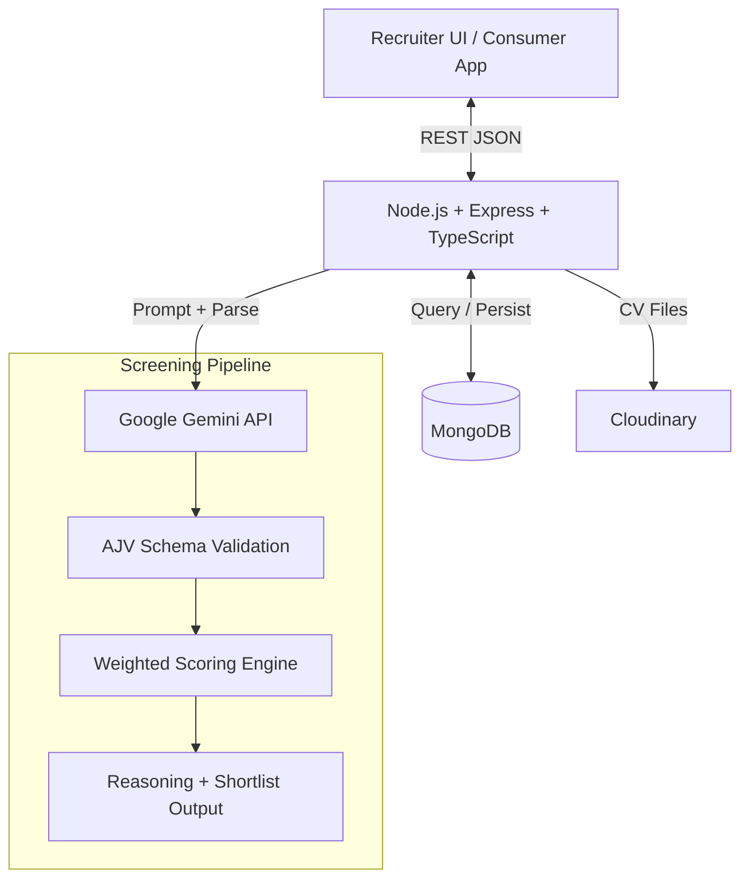

# Umurava AI Talent Screening Platform (Backend)

Production-oriented backend API for AI-assisted applicant screening in the Umurava AI Hackathon.

This service helps recruiters:
- create and publish jobs,
- ingest applicants from structured profiles, CV uploads, and spreadsheets,
- run AI-based candidate screening,
- receive ranked shortlists (Top 10 or Top 20) with explainable reasoning,
- keep final hiring decisions human-led.

## Executive Summary

This backend delivers an AI-assisted recruiter workflow for Umurava's hackathon problem: screening large candidate pools accurately, transparently, and efficiently while keeping final hiring decisions with humans.

It supports both required scenarios:
- Scenario 1: structured Umurava talent profiles,
- Scenario 2: external applicant sources (CSV/Excel and PDF resumes).

The platform uses Gemini API for candidate analysis, AJV for strict response validation, and a weighted scoring engine for consistent ranking. The resulting shortlist returns clear recruiter-facing explanations (strengths, gaps, recommendation) for each candidate.

## Table of Contents

- [Executive Summary](#executive-summary)
- [1. Hackathon Marking Criteria Coverage](#1-hackathon-marking-criteria-coverage)
- [2. Problem Statement](#2-problem-statement)
- [3. Scope Implemented](#3-scope-implemented)
- [4. Core Features](#4-core-features)
- [5. High-Level Architecture & Technical Design](#5-high-level-architecture--technical-design)
- [6. AI Decision Flow](#6-ai-decision-flow)
- [7. AI Scoring Logic](#7-ai-scoring-logic)
- [8. Prompt Engineering Approach](#8-prompt-engineering-approach)
- [9. Recruiter Decision Support](#9-recruiter-decision-support)
- [10. Tech Stack](#10-tech-stack)
- [11. API Overview](#11-api-overview)
- [12. Environment Variables](#12-environment-variables)
- [13. Local Setup](#13-local-setup)
- [14. Deployment](#14-deployment)
- [15. Testing and Verification](#16-testing-and-verification)
- [16. Assumptions and Limitations](#17-assumptions-and-limitations)
- [17. Submission Checklist](#18-submission-checklist)
- [18. Production Monitoring & Error Handling](#19-production-monitoring--error-handling)
- [19. AI Reliability & Key Rotation](#20-ai-reliability--key-rotation)
- [20. Team Members](#21-team-members)

## 1. Hackathon Marking Criteria Coverage

| Requirement Area | How This Project Addresses It |
|---|---|
| Practical relevance | Solves high-volume screening and shortlist generation for recruiter workflows |
| AI clarity and responsibility | Uses structured AI output, schema validation, deterministic scoring, and explainable reasoning |
| Engineering quality | Modular TypeScript architecture, validation, auth, rate limiting, logging, API docs |
| Product thinking | Recruiter-focused flows: job setup, ingestion, screening trigger, shortlist retrieval |
| Mandatory LLM | Google Gemini API integration via @google/generative-ai |
| Deployment | Ready for Railway/Render/Fly and MongoDB Atlas |

## 2. Problem Statement

Recruiters face:
- high applicant volume that increases time-to-hire,
- difficulty comparing candidates objectively across mixed profile formats.

This backend solves:
- job-to-candidate matching,
- AI-assisted ranking and shortlisting,
- transparent reasoning (strengths, gaps, recommendation),
- support for structured profiles and unstructured resumes.

## 3. Scope Implemented

### Scenario 1: Umurava Structured Talent Profiles
- Job creation from recruiter input.
- Candidate screening for applicants tied to a job.
- Ranked shortlist with AI reasoning.

### Scenario 2: External Job Board Applicants
- Bulk import via CSV/Excel.
- Batch CV upload (PDF).
- Resume parsing and profile extraction.
- Candidate-to-job matching and ranking.

## 4. Core Features

- Job creation and editing in draft mode.
- Job publishing workflow.
- Applicant profile ingestion and management.
- Bulk sourcing from files and CV batches.
- Screening trigger endpoint for AI-powered ranking.
- Ranked shortlist retrieval.
- Explainable output per candidate:
  - rank,
  - match score (0-100),
  - strengths,
  - gaps/risks,
  - recommendation.

## 5. High-Level Architecture




### Technical Design Principles
- **Modular Layered Architecture**: Clear separation between routes, controllers, services, and repositories.
- **AI Orchestration Logic**: A dedicated AI module manages prompts, interactions, and strict validation outside of business services.
- **Stateless & Deterministic**: Scoring is pure math; given the same inputs, the engine always produces the exact same score.
- **Security by Design**: JWT authentication, rate limiting, and origin-based CORS hardening.
- **Safety & Quality**: Strict schema compliance via JSON response enforcement and AJV validation.

## 6. AI Decision Flow

1. **Trigger**: Recruiter initiates screening for a specific job via the dashboard.
2. **Data Assembly**: The system fetches job criteria and all associated candidate profiles.
3. **AI Inference**: Gemini generates structured comparative insights using role-specific prompt templates.
4. **Validation**: AJV strictly validates the AI output against a predefined JSON schema.
5. **Scoring**: The engine computes weighted scores across five key dimensions (Skills, Experience, Education, Resources, Soft Skills).
6. **Ranking**: Candidates are ranked by score, and a final shortlist is prepared.
7. **Delivery**: The API returns the ranked list with human-readable reasoning for every profile.

## 7. AI Scoring Logic

The platform uses a **stateless, deterministic scoring engine** (`ScreeningScorer`) to ensure consistent results. Candidates are evaluated across five key dimensions, each producing a score between `0.0` and `1.0`.

### The Five Dimensions
1.  **Skills (Weighted Average)**: Evaluates hard skills against job requirements. AI signals (0 = absent, 0.5 = partial, 1.0 = full match) are multiplied by the skill's importance weight.
2.  **Experience (Linear Scale)**: Calculated as `min(candidateYears / requiredYears, 1.0)`. Note: A 15% tolerance is applied (e.g., 1.7 years can satisfy a 2-year requirement if other signals are strong).
3.  **Education (Tier Comparison)**: Degrees are mapped to numeric tiers (PhD: 1.0, Master: 0.9, Bachelor: 0.75, etc.). The score is the ratio of the candidate's highest degree to the job's requirement.
4.  **Resources (Proportion)**: Checks for required tools/resources (e.g., Laptop, Stable Internet) in the candidate's profile and CV text.
5.  **Soft Skills (Weighted Average)**: AI-inferred signals for interpersonal traits (e.g., Communication, Leadership) weighted by importance.

### Final Score Formula
The final score (0–100) is a weighted combination of these dimensions based on the recruiter's custom configuration:
`Final Score = Σ (Dimension Score × Category Weight) × 100`

### Disqualification & Status
- **Shortlisted**: Candidates with a `Final Score >= 60` (or `85` if hard rules are violated but score is exceptional).
- **Rejected**: Candidates falling below the threshold.
- **Hard Rules**: Recruiters can enforce "Must have required skills" or "Must meet minimum experience," which triggers an automatic status flag even if the score is high.

## 8. Prompt Engineering Approach

This system uses documented, version-controlled prompt templates as part of the production AI pipeline.

### Prompting Pattern
- **System Separation**: System prompts are loaded from versioned files, ensuring logic is decoupled from code.
- **Schema-Driven Prompting**: Every request includes a built-in JSON schema (using `response_mime_type: "application/json"`) that forces the AI to structure its response exactly as expected.
- **Output Guardrails**: Includes AJV validation, deterministic temperature (0), and fallback behavior for AI failures.

### Prompt Catalog Used in This Backend

| Prompt File | Purpose |
|---|---|
| src/modules/ai/prompts/job.prompt.txt | Parse and normalize job descriptions |
| src/modules/ai/prompts/generate-job.prompt.txt | Generate structured job object from raw input |
| src/modules/ai/prompts/cv-parser.prompt.txt | Extract structured applicant profile from CV text |
| src/modules/ai/prompts/screening-batch.prompt.txt | Evaluate all candidates for a job in batch |
| src/modules/ai/prompts/cover-letter.prompt.txt | Generate or evaluate cover letter content |

## 9. Recruiter Decision Support

The AI does not "hire" candidates; it acts as a **high-precision filter** and **decision-support tool** for recruiters.

### How Recruiters Use the Output
1.  **Ranked Shortlist**: Recruiters start with the most qualified candidates at the top of their dashboard.
2.  **Explainable Reasoning**: For every candidate, the AI provides:
    *   **Strengths**: Direct evidence of why they match (e.g., "5+ years of React experience").
    *   **Gaps**: Honest assessment of missing pieces (e.g., "Lacks experience with Kubernetes").
    *   **Recommendation**: A natural-language summary of their fit.
3.  **Dimension Breakdown**: Recruiters can see exactly *why* a score is high or low (e.g., "Candidate has great skills but lacks the required Master's degree").
4.  **Human-in-the-Loop**: Recruiters use these insights to quickly decide whom to interview, drastically reducing manual "CV skimming" time while maintaining final oversight.

## 10. Tech Stack

- **Language**: TypeScript
- **Backend**: Node.js + Express
- **Database**: MongoDB
- **AI/LLM**: Gemini API (mandatory)
- **File Parsing**: pdf-parse, xlsx
- **Validation**: AJV
- **Documentation**: Swagger (OpenAPI)
- **Monitoring**: Sentry

## 11. API Overview

Base path: /api/v1

### Main Recruiter Flows
- Auth: register/login/refresh
- Jobs: create/list/publish/edit
- Screening: trigger + shortlist retrieval
- Sourcing: spreadsheet import + batch CV upload

### Key Endpoints

| Method | Endpoint | Purpose |
|---|---|---|
| POST | /api/v1/jobs | Create structured job from recruiter description |
| PATCH | /api/v1/jobs/:id | Update draft job |
| PATCH | /api/v1/jobs/:id/publish | Publish draft job |
| POST | /api/v1/jobs/:jobId/screen | Trigger AI screening |
| GET | /api/v1/jobs/:jobId/shortlist | Get ranked shortlist |
| POST | /api/v1/sourcing/bulk-import | Import candidates via CSV/Excel |
| POST | /api/v1/sourcing/batch-upload-cvs | Upload multiple PDF CVs |

Full interactive docs:
- GET /api/v1/docs
- GET /api/v1/docs.json

## 12. Environment Variables

Create .env from .env.example and set:

| Variable | Description |
|---|---|
| PORT | API port |
| MONGODB_URI | MongoDB connection string |
| JWT_SECRET | Access token secret |
| REFRESH_SECRET | Refresh token secret |
| GEMINI_API_KEY | Google Gemini API key (supports multiple comma-separated keys for auto-rotation) |
| GEMINI_AI_MODEL | Gemini model name |
| SENTRY_DSN | Sentry DSN used by the SDK |
| SENTRY_RELEASE | Optional release name or commit SHA |
| SENTRY_TRACES_SAMPLE_RATE | Optional tracing sample rate, usually 0 for error-only reporting |
| CLOUDINARY_CLOUD_NAME | Cloudinary cloud name |
| CLOUDINARY_API_KEY | Cloudinary API key |
| CLOUDINARY_API_SECRET | Cloudinary API secret |

## 13. Local Setup

Prerequisites:
- Node.js 20+
- MongoDB instance (local or Atlas)

Install and run:

```bash
npm install
cp .env.example .env
npm run dev
```

Production start:

```bash
npm start
```

## 14. Deployment

Recommended:
- Backend: Railway / Render / Fly.io
- Database: MongoDB Atlas

Deployment expectations covered:
- online accessible API,
- environment variables configured in host dashboard,
- production-safe logging and error handling.

## 15. Testing and Verification

Run tests:

```bash
npm test
```

Manual verification scripts:

```bash
npx tsx scripts/test-ai.ts
npx tsx scripts/test-job.ts
npx tsx scripts/test-cv.ts
```

## 16. Assumptions and Limitations

- PDF is the supported resume document format for CV upload routes.
- Batch CV upload has an upper limit for stability.
- AI quality depends on input quality and configured scoring weights.
- External provider quotas (Gemini, Cloudinary) may impact throughput.
- Final hiring decision remains with recruiter (human-in-the-loop).

## 17. Submission Checklist

- Backend docs URL: https://umurava-be.up.railway.app/api/v1/docs/
- Frontend URL: https://umurava-fe.vercel.app/
- Live backend URL shared.
- Repository accessible with complete README.
- Gemini API used for screening logic.
- Recruiter screening flow demonstrable end to end.
- Explainable shortlist output available.
- API documentation available via Swagger route.
- Prompt engineering approach documented with prompt catalog and template.
- Assumptions and limitations documented.

## 18. Production Monitoring & Error Handling

This system uses Sentry for production error tracking and resolution automation.

### Sentry Integration

Sentry captures and monitors runtime errors, performance issues, and application health in production.

**Key Features:**
- Real-time error tracking and alerting.
- Performance monitoring and transaction tracking.
- Source map support for stack trace deobfuscation.
- GitHub repository integration for automated issue resolution.

### Sentry Seer AI Auto-Resolution

Sentry's Seer AI automates error analysis and resolution:

1. **Error Detection**: Seer automatically analyzes error patterns and traces to identify root causes.
2. **Issue Classification**: Groups similar errors and identifies duplicates.
3. **GitHub Integration**: When connected to the project repository, Seer can:
   - Suggest fixes and code changes.
   - Automatically create pull requests with fixes.
   - Link PRs to the originating error issue.
4. **Manual Merge**: Team leads review and merge the auto-generated PRs into the codebase.

### Configuration

Environment variable for Sentry:

| Variable | Description |
|---|---|
| SENTRY_DSN | Sentry Data Source Name for error tracking |

### Benefits

- Faster error detection and resolution in production.
- Reduced mean time to recovery (MTTR).
- Automated PR submission reduces manual debugging overhead.
- Full GitHub audit trail for compliance and transparency.

## 19. AI Reliability & Key Rotation

To ensure uninterrupted service during high-volume document parsing or screening, this backend implements a smart **API Key Rotation** strategy:

- **Multi-Key Support**: You can provide multiple Gemini API keys in the `GEMINI_API_KEY` variable (comma-separated).
- **Auto-Failover**: If a key hits a rate limit (429 error) or quota limit, the system automatically rotates to the next available key and retries the request.
- **Resilience**: This prevents the system from stopping mid-process, which is critical for large-scale candidate screening.

| Variable | Support |
|---|---|
| GEMINI_API_KEY | `key1,key2,key3` |

## 20. Team Members

1. MWIMULE BIENVENU - Full Stack Developer, Frontend and Backend
   - Email: bienvenugashema@gmail.com
2. IKAZE MAHORO FABIOLA - AI Logic and AI Engineering
   - Email: fabiolaikaze@gmail.com
3. BAGALE GLOIRE - QA Tester
   - Email: bgloire40@gmail.com


