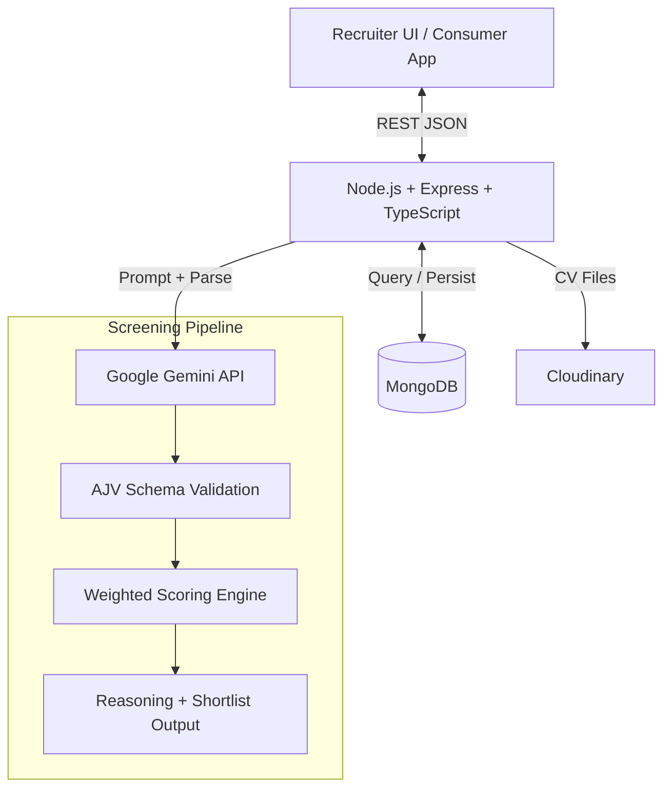

# Umurava AI Talent Screening Platform (Backend)

Production-oriented backend API for AI-assisted applicant screening in the Umurava AI Hackathon.

This service helps recruiters:
- create and publish jobs,
- ingest applicants from structured profiles, CV uploads, and spreadsheets,
- run AI-based candidate screening,
- receive ranked shortlists (Top 10 or Top 20) with explainable reasoning,
- keep final hiring decisions human-led.

## Executive Summary

This backend delivers an AI-assisted recruiter workflow for Umurava's hackathon problem: screening large candidate pools accurately, transparently, and efficiently while keeping final hiring decisions with humans.

It supports both required scenarios:
- Scenario 1: structured Umurava talent profiles,
- Scenario 2: external applicant sources (CSV/Excel and PDF resumes).

The platform uses Gemini API for candidate analysis, AJV for strict response validation, and a weighted scoring engine for consistent ranking. The resulting shortlist returns clear recruiter-facing explanations (strengths, gaps, recommendation) for each candidate.

## Table of Contents

- [Executive Summary](#executive-summary)
- [1. Hackathon Marking Criteria Coverage](#1-hackathon-marking-criteria-coverage)
- [2. Problem Statement](#2-problem-statement)
- [3. Scope Implemented](#3-scope-implemented)
- [4. Core Features](#4-core-features)
- [5. High-Level Architecture](#5-high-level-architecture)
- [6. AI Decision Flow](#6-ai-decision-flow)
- [7. Prompt Engineering Approach](#7-prompt-engineering-approach)
- [8. Tech Stack](#8-tech-stack)
- [9. Technical Design Summary](#9-technical-design-summary)
- [10. API Overview](#10-api-overview)
- [11. Environment Variables](#11-environment-variables)
- [12. Local Setup](#12-local-setup)
- [13. Deployment](#13-deployment)
- [14. Testing and Verification](#14-testing-and-verification)
- [15. Assumptions and Limitations](#15-assumptions-and-limitations)
- [16. Submission Checklist](#16-submission-checklist)
- [17. Production Monitoring & Error Handling](#17-production-monitoring--error-handling)
- [18. Team Members](#18-team-members)

## 1. Hackathon Marking Criteria Coverage

| Requirement Area | How This Project Addresses It |
|---|---|
| Practical relevance | Solves high-volume screening and shortlist generation for recruiter workflows |
| AI clarity and responsibility | Uses structured AI output, schema validation, deterministic scoring, and explainable reasoning |
| Engineering quality | Modular TypeScript architecture, validation, auth, rate limiting, logging, API docs |
| Product thinking | Recruiter-focused flows: job setup, ingestion, screening trigger, shortlist retrieval |
| Mandatory LLM | Google Gemini API integration via @google/generative-ai |
| Deployment | Ready for Railway/Render/Fly and MongoDB Atlas |

## 2. Problem Statement

Recruiters face:
- high applicant volume that increases time-to-hire,
- difficulty comparing candidates objectively across mixed profile formats.

This backend solves:
- job-to-candidate matching,
- AI-assisted ranking and shortlisting,
- transparent reasoning (strengths, gaps, recommendation),
- support for structured profiles and unstructured resumes.

## 3. Scope Implemented

### Scenario 1: Umurava Structured Talent Profiles
- Job creation from recruiter input.
- Candidate screening for applicants tied to a job.
- Ranked shortlist with AI reasoning.

### Scenario 2: External Job Board Applicants
- Bulk import via CSV/Excel.
- Batch CV upload (PDF).
- Resume parsing and profile extraction.
- Candidate-to-job matching and ranking.

## 4. Core Features

- Job creation and editing in draft mode.
- Job publishing workflow.
- Applicant profile ingestion and management.
- Bulk sourcing from files and CV batches.
- Screening trigger endpoint for AI-powered ranking.
- Ranked shortlist retrieval.
- Explainable output per candidate:
  - rank,
  - match score (0-100),
  - strengths,
  - gaps/risks,
  - recommendation.

## 5. High-Level Architecture



## 6. AI Decision Flow

1. Recruiter triggers screening for a specific job.
2. System fetches job criteria and all candidate profiles linked to that job.
3. Gemini generates structured comparative insights.
4. AJV validates AI output against expected schema.
5. Scoring engine computes weighted score across key dimensions.
6. Candidates are ranked and shortlist is returned.
7. API includes human-readable reasoning for each shortlisted profile.

### Scoring Dimensions
- Skills
- Experience
- Education
- Resources/portfolio signals
- Soft skills

### Reliability and Explainability
- Structured JSON response enforcement.
- Retry handling for temporary AI quota/rate-limit failures.
- Deterministic fallback reasoning when AI output is unavailable.
- Explicit score and reason fields for recruiter transparency.

## 7. Prompt Engineering Approach

This system uses documented, version-controlled prompt templates as part of the production AI pipeline.

Prompt engineering documentation in this repository covers:
- prompt design strategy,
- prompt files used in production,
- representative prompt template excerpts,
- output guardrails (schema validation, deterministic config, fallback behavior).

### Prompt Catalog Used in This Backend

| Prompt File | Purpose |
|---|---|
| src/modules/ai/prompts/job.prompt.txt | Parse and normalize job descriptions |
| src/modules/ai/prompts/generate-job.prompt.txt | Generate structured job object from raw input |
| src/modules/ai/prompts/cv-parser.prompt.txt | Extract structured applicant profile from CV text |
| src/modules/ai/prompts/screening-batch.prompt.txt | Evaluate all candidates for a job in batch |
| src/modules/ai/prompts/cover-letter.prompt.txt | Generate or evaluate cover letter content |

### Prompting Pattern

- System prompt is loaded from prompt files and versioned with code.
- Runtime input is injected as a separate Input block.
- Gemini response is required as JSON and validated against schema.
- Generation config is tuned for consistent output (temperature 0).

### Representative Prompt Template (Screening)

```text
You are an expert technical recruiter performing a structured candidate screening.

You will receive:
1. Job context (skills, requirements, seniority)
2. Candidate profiles

Return JSON only with, for each candidate:
- applicant_id
- skill_signals
- soft_skill_signals
- strengths
- gaps
- recommendation

Do not output markdown. Do not add extra keys.
```

### Evaluation Alignment

- Demonstrates intentional prompt engineering (explicit requirement).
- Shows reproducibility and explainability.
- Proves that scoring output is structured and recruiter-friendly.

## 8. Tech Stack

- Language: TypeScript
- Backend: Node.js + Express
- Database: MongoDB
- AI/LLM: Gemini API (mandatory)
- File parsing: pdf-parse, xlsx
- Validation: AJV
- Documentation: Swagger (OpenAPI)

## 9. Technical Design Summary

### Architecture Style
- Modular layered backend with route, controller, service, and repository separation.
- Clear boundary between business logic and AI orchestration logic.

### Data and Processing Pipeline
- Job intake and normalization into structured criteria.
- Applicant ingestion from profile, spreadsheet, and resume channels.
- Multi-candidate screening pipeline producing a ranked shortlist.

### AI Safety and Output Quality Controls
- Prompted Gemini responses are validated against expected schemas.
- Retry and fallback mechanisms reduce screening interruptions.
- Explainability fields are included by design to support recruiter trust.

### Security and Reliability
- JWT-based authentication for protected routes.
- Rate limiting and middleware-based request protection.
- Production logging and error handling for deployable operations.

## 10. API Overview

Base path: /api/v1

### Main Recruiter Flows
- Auth: register/login/refresh
- Jobs: create/list/publish/edit
- Screening: trigger + shortlist retrieval
- Sourcing: spreadsheet import + batch CV upload

### Key Endpoints

| Method | Endpoint | Purpose |
|---|---|---|
| POST | /api/v1/jobs | Create structured job from recruiter description |
| PATCH | /api/v1/jobs/:id | Update draft job |
| PATCH | /api/v1/jobs/:id/publish | Publish draft job |
| POST | /api/v1/jobs/:jobId/screen | Trigger AI screening |
| GET | /api/v1/jobs/:jobId/shortlist | Get ranked shortlist |
| POST | /api/v1/sourcing/bulk-import | Import candidates via CSV/Excel |
| POST | /api/v1/sourcing/batch-upload-cvs | Upload multiple PDF CVs |

Full interactive docs:
- GET /api/v1/docs
- GET /api/v1/docs.json

## 11. Environment Variables

Create .env from .env.example and set:

| Variable | Description |
|---|---|
| PORT | API port |
| MONGODB_URI | MongoDB connection string |
| JWT_SECRET | Access token secret |
| REFRESH_SECRET | Refresh token secret |
| GEMINI_API_KEY | Google Gemini API key |
| GEMINI_AI_MODEL | Gemini model name |
| SENTRY_DSN | Sentry DSN used by the SDK |
| SENTRY_RELEASE | Optional release name or commit SHA |
| SENTRY_TRACES_SAMPLE_RATE | Optional tracing sample rate, usually 0 for error-only reporting |
| CLOUDINARY_CLOUD_NAME | Cloudinary cloud name |
| CLOUDINARY_API_KEY | Cloudinary API key |
| CLOUDINARY_API_SECRET | Cloudinary API secret |

## 12. Local Setup

Prerequisites:
- Node.js 20+
- MongoDB instance (local or Atlas)

Install and run:

```bash
npm install
cp .env.example .env
npm run dev
```

Production start:

```bash
npm start
```

## 13. Deployment

Recommended:
- Backend: Railway / Render / Fly.io
- Database: MongoDB Atlas

Deployment expectations covered:
- online accessible API,
- environment variables configured in host dashboard,
- production-safe logging and error handling.

## 14. Testing and Verification

Run tests:

```bash
npm test
```

Manual verification scripts:

```bash
npx tsx scripts/test-ai.ts
npx tsx scripts/test-job.ts
npx tsx scripts/test-cv.ts
```

## 15. Assumptions and Limitations

- PDF is the supported resume document format for CV upload routes.
- Batch CV upload has an upper limit for stability.
- AI quality depends on input quality and configured scoring weights.
- External provider quotas (Gemini, Cloudinary) may impact throughput.
- Final hiring decision remains with recruiter (human-in-the-loop).

## 16. Submission Checklist

- Backend docs URL: https://umurava-be.up.railway.app/api/v1/docs/
- Frontend URL: https://umurava-fe.vercel.app/
- Live backend URL shared.
- Repository accessible with complete README.
- Gemini API used for screening logic.
- Recruiter screening flow demonstrable end to end.
- Explainable shortlist output available.
- API documentation available via Swagger route.
- Prompt engineering approach documented with prompt catalog and template.
- Assumptions and limitations documented.

## 17. Production Monitoring & Error Handling

This system uses Sentry for production error tracking and resolution automation.

### Sentry Integration

Sentry captures and monitors runtime errors, performance issues, and application health in production.

**Key Features:**
- Real-time error tracking and alerting.
- Performance monitoring and transaction tracking.
- Source map support for stack trace deobfuscation.
- GitHub repository integration for automated issue resolution.

### Sentry Seer AI Auto-Resolution

Sentry's Seer AI automates error analysis and resolution:

1. **Error Detection**: Seer automatically analyzes error patterns and traces to identify root causes.
2. **Issue Classification**: Groups similar errors and identifies duplicates.
3. **GitHub Integration**: When connected to the project repository, Seer can:
   - Suggest fixes and code changes.
   - Automatically create pull requests with fixes.
   - Link PRs to the originating error issue.
4. **Manual Merge**: Team leads review and merge the auto-generated PRs into the codebase.

### Configuration

Environment variable for Sentry:

| Variable | Description |
|---|---|
| SENTRY_DSN | Sentry Data Source Name for error tracking |

### Benefits

- Faster error detection and resolution in production.
- Reduced mean time to recovery (MTTR).
- Automated PR submission reduces manual debugging overhead.
- Full GitHub audit trail for compliance and transparency.

## 18. Team Members

1. MWIMULE BIENVENU - Full Stack Developer, Frontend and Backend
   - Email: bienvenugashema@gmail.com
2. IKAZE MAHORO FABIOLA - AI Logic and AI Engineering
   - Email: fabiolaikaze@gmail.com
3. BAGALE GLOIRE - QA Tester
   - Email: bgloire40@gmail.com


